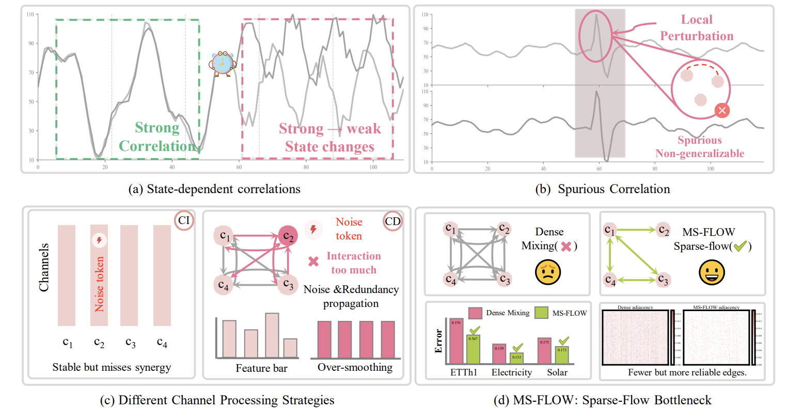
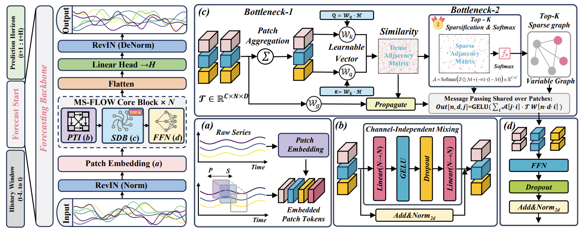

<div align="center">


## What If We Let Forecasting Forget? A Sparse Bottleneck for Cross-Variable Dependencies

**The 43rd International Conference on Machine Learning (ICML 2026)**

[Code](https://github.com/Cola-Fsm/MS-FLOW) | [Paper](https://arxiv.org/pdf/2605.08289)

</div>


## Introduction


> **The key to multivariate forecasting is not always more interaction, but more effective interaction.**

<div align="center">
  
</div>


<p align="center">
  <b>Figure 1.</b> Motivation of MS-FLOW. Cross-variable dependencies can be state-dependent and noisy, while dense interaction may propagate redundant or spurious correlations. MS-FLOW introduces sparse information flow to retain fewer but more reliable dependency paths.
</p>


## Overview


<div align="center">
  
</div>


<p align="center">
  <b>Figure 2.</b> Overall architecture of MS-FLOW. Historical observations are represented at the patch level, temporally refined, and then passed through a sparse dependency bottleneck that selectively routes cross-variable information before producing the final forecast.
</p>


## Repository Structure

```text
MS-FLOW/
├── data_provider/          # Data loading and preprocessing
├── exp/                    # Experiment pipeline
├── img/
│   ├── intr.png            # Motivation figure
│   └── model.png           # Overall architecture
├── layers/                 # Network layers
├── models/                 # MS-FLOW and forecasting models
├── scripts/                # Running scripts
├── utils/                  # Utility functions
├── run.py                  # Main entry point
├── requirements.txt        # Python dependencies
└── README.md
```

> The exact folder names can be adjusted according to the released repository.


## Requirements

Clone this repository and install the required packages:

```bash
git clone https://github.com/Cola-Fsm/MS-FLOW.git
cd MS-FLOW

pip install -r requirements.txt
```

The implementation is based on **PyTorch**.


## Citation

If you find this repository useful, please consider citing our work:

```bibtex
@inproceedings{zhang2026msflow,
  title     = {What If We Let Forecasting Forget? A Sparse Bottleneck for Cross-Variable Dependencies},
  author    = {Fan Zhang and Shiming Fan and Hua Wang},
  booktitle = {Proceedings of the 43rd International Conference on Machine Learning},
  year      = {2026}
}
```


## Contact

If you have any questions regarding the paper or code, please submit an issue in this repository or feel free to send an email.


## Acknowledgements

We appreciate the following resources a lot for their valuable code and datasets:

- Time-Series-Library ([https://github.com/thuml/Time-Series-Library](https://github.com/thuml/Time-Series-Library))
- iTransformer ([https://github.com/thuml/iTransformer](https://github.com/thuml/iTransformer))
- BasicTS ([https://github.com/GestaltCogTeam/BasicTS](https://github.com/GestaltCogTeam/BasicTS))
- TFB ([https://github.com/decisionintelligence/TFB](https://github.com/decisionintelligence/TFB))
